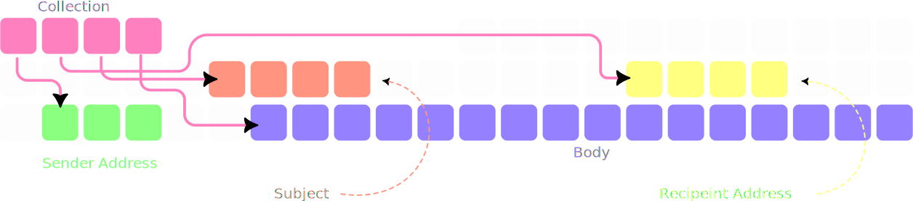

# Tuples are lighter than a list

## Motivation

We all know the existence of the *list* data type in python. Then why invent the **tuple**? Oh, because its lighter⚖️ than a list. If tuples are lighter then why use lists at all. Because they are mutable. Why don't we have both characteristics in a single data type🤦🏻‍♂️. To understand this, let's see how data is stored in them

## The mechanism of storage
When we think of a list/tuple, let's call it a collection to avoid confusion, we think how ordered it is, and we naturally assume that data is arranged that way in memory. But that is inaccurate. A collection can hold different datatype and more importantly, different sizes of data. To bring this into perspective, imagine storing information of an email

Sample email✉️ data:

- Sender🧔🏻‍♂️ address = 30 chars
- recipient👶🏻 address = 40 chars
- subject = 80 chars
- body📃 = 160 chars


Well, we could expand subject from 80 to 100 chars and observe what's gonna happen 💥... But that's not a discussion for now. Now let's say we edited the subject and made it 40 chars. Then there would be a gap in between the start addresses


If the gap is to be, then why store data that way. Instead a collection stores the address of data in a sequence. The data can be stored anywhere else in the memory. Only the sequence needs to be in the correct order inside the collection



### Lists are mutable 
If a list has 4 elements to store, then we don;t exactly create 4 address boxes. Because, imagine a scenario where we found a compact space in memory, that can fit exactly 4 boxes. If something were to be appended to the list, then python needs to copy the addresses to a new location where it can put 5 addresses. This is kind of like moving the house🏠 whenever you run out of space. This moving of house is a costly operation. You wanna do it, when you only really wanna do it. Naturally, you would choose a house with extra space in it


Hence, a list always creates more address boxes than necessary. This extra rooms in the house (anticipating more luggage) costs us more memory. And because a tuple does not has `.append()` it would create the exact number of boxes

So, now you know why. Let's really drive the point home using a code block

```python
import sys

# Create a list and a tuple with the same elements
my_collection = list(range(100))
my_list = list(my_collection)
my_tuple = tuple(my_collection)

# Get sizes in bytes
list_size = sys.getsizeof(my_list)
tuple_size = sys.getsizeof(my_tuple)

print(f"List size (100 elements): {list_size} bytes")
print(f"Tuple size (100 elements): {tuple_size} bytes")
print(f"Difference: {list_size - tuple_size} bytes")
```
```
# Output
List size (100 elements): 856 bytes
Tuple size (100 elements): 848 bytes
Difference: 8 bytes
```
